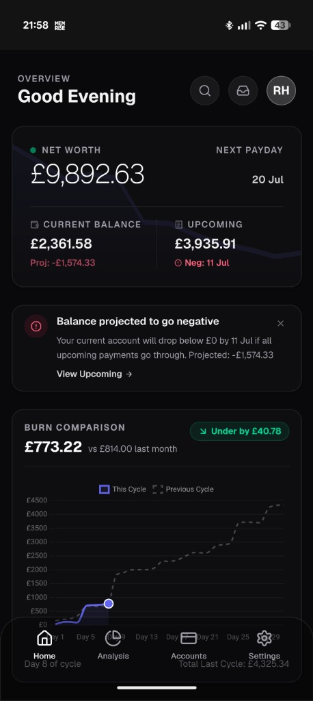
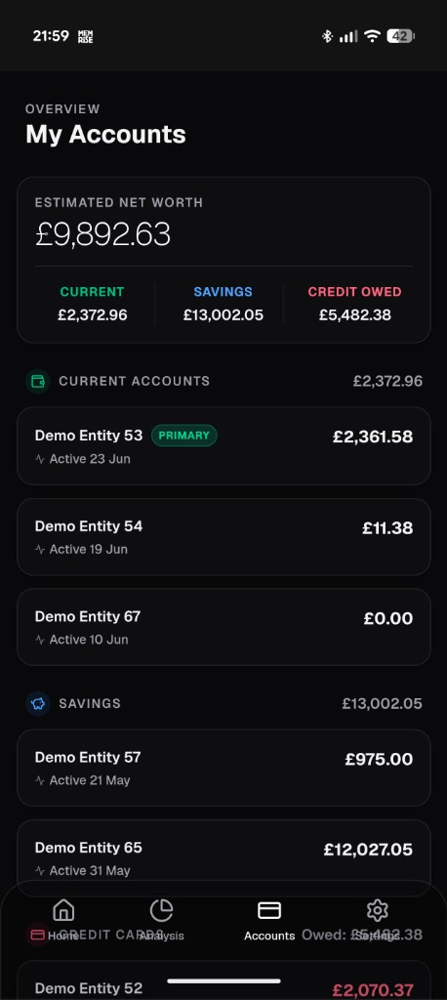
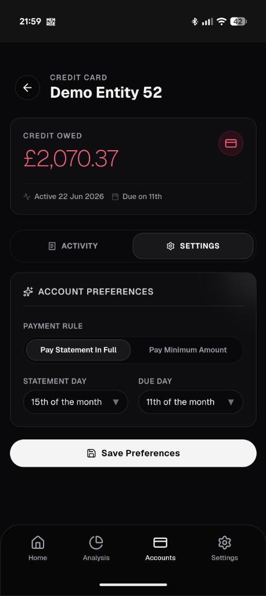
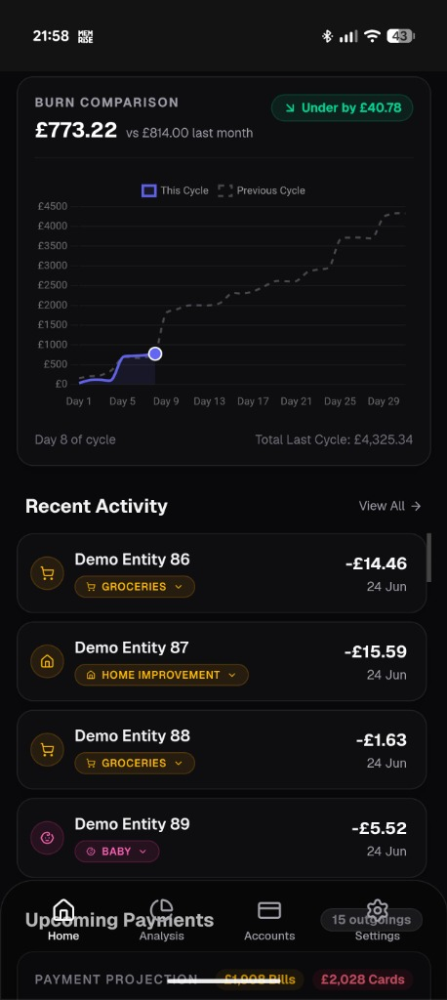
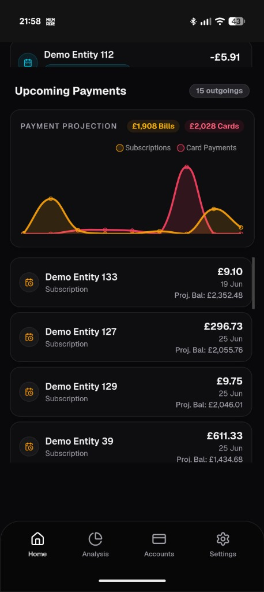

# Firefly Personal Financial Dashboard

[](https://buymeacoffee.com/giorobert)

An interactive, responsive financial dashboard optimized for mobile layouts, connecting directly to a **Firefly III** instance. Designed to track Safe-to-Spend pacing, upcoming cycle outgoings, and categorizing transactions on the fly.

## Key Features

1. **Safe-to-Spend Analysis**: Computes disposable income based on total asset balance, subtracting upcoming unpaid bills and credit card statements up to your next payday.
2. **Dynamic Burn Comparison**: Renders an interactive line chart comparing cumulative daily spend against the previous cycle's pacing.
3. **Interactive Uncategorized Queue (`/uncategorized`)**: 
   - Displays transactions from the last 7 days without a category.
   - Accessible via the **Inbox icon** in the main header (which displays a badge count of pending items).
   - Category updates are sent directly to Firefly III, and the transaction is cleared from the queue with a smooth fade animation.
4. **Grouped Accounts Ledger**: Displays active asset and liability accounts structured into *Current Accounts*, *Savings*, and *Credit Cards* with individual activity states.
5. **Credit Card Payment Rules**: Configure statement cycles (statement/due day) and payment preferences (Full statement balance vs Minimum payment calculations) inside the app. Rules are persisted directly within Firefly III as JSON metadata inside each account's notes field.

---

## Technical Stack

- **Framework**: Next.js 16.2 (App Router)
- **Styling**: Tailwind CSS & Vanilla CSS (using a custom `glass-card` system)
- **Charts**: Chart.js (`react-chartjs-2`)
- **Icons**: Lucide React
- **API**: Custom integration layer in `src/lib/firefly.ts` connecting to Firefly III Core v1 API.

---

## Screenshots

Here is a preview of the mobile-first dashboard running in **Demo Mode**:

| Home Dashboard | Accounts Overview | Account Settings |
| :---: | :---: | :---: |
|  |  |  |

| Recent Activity | Upcoming Payments |
| :---: | :---: |
|  |  |

---

## Getting Started

### 1. Configure Environment

Copy the example environment file and fill in your values:

```bash
cp .env.example .env.local
```

Then edit `.env.local`:
```env
SESSION_SECRET="generate-with-openssl-rand-base64-32"

# Optional (Can be configured in the UI instead)
# FIREFLY_API_URL="http://your-firefly-server:8080"
# FIREFLY_PAT="your-firefly-personal-access-token"
```

> **Tips:**
> - Generate a secure session secret with: `openssl rand -base64 32`
> - **Mandatory Environment Variable**: `SESSION_SECRET` is the only environment variable strictly required to start the app.
> - **API Connection**: You can configure your Firefly III API URL and Personal Access Token (PAT) directly in the dashboard UI under **Settings > API Connection**. They will be saved securely on the server. Alternatively, you can pre-configure them by uncommenting the environment variables above.

### 2. Install Dependencies

```bash
npm install
```

### 3. Run in Development

```bash
npm run dev
```

The dashboard will be available at [http://localhost:3001](http://localhost:3001).

### 4. First-Time Setup

On first launch, you'll be prompted to create a dashboard password. This password is stored locally on the server and used to protect access to your financial data.

---

## Docker Deployment

The application is distributed as a pre-built multi-architecture Docker image (`linux/amd64` and `linux/arm64`) via GitHub Container Registry (GHCR), meaning you don't even need the source code to run it.

### Running with Docker

1. **Prepare configuration files** in a dedicated directory on your server:

   **docker-compose.yml**:
   ```yaml
   services:
     dashboard:
       image: ghcr.io/giorobert88/financial-dashboard:latest
       container_name: firefly-dashboard
       restart: unless-stopped
       ports:
         - "3001:3000"
       env_file:
         - .env.local
       environment:
         - AUTH_FILE_PATH=/app/data/.dashboard_auth
       volumes:
         - dashboard_data:/app/data

   volumes:
     dashboard_data:
   ```

   **.env.local**:
   ```env
   SESSION_SECRET="generate-with-openssl-rand-base64-32"

   # Optional (Can be configured in the UI instead)
   # FIREFLY_API_URL="http://your-firefly-server:8080"
   # FIREFLY_PAT="your-firefly-personal-access-token"
   ```

2. **Start the container**:
   ```bash
   docker compose up -d
   ```

To stop the dashboard: `docker compose down`. To inspect output: `docker compose logs -f`.

*Note: The `./data` directory will be created automatically to securely persist your dashboard password across container updates.*

### Building & Running Locally with Docker

If you want to build and run the Docker image locally from source:

1. **Build the image**:
   ```bash
   docker build -t financial-dashboard:local .
   ```

2. **Run the container**:
   ```bash
   docker run -d \
     -p 3001:3000 \
     --env-file .env.local \
     -v dashboard_data:/app/data \
     --name financial-dashboard \
     financial-dashboard:local
   ```

---

## Project Structure

```
src/
├── app/
│   ├── actions/         # Server actions (auth, transactions, automations)
│   ├── api/             # API routes
│   ├── dashboard/       # Dashboard pages with cycle navigation
│   ├── login/           # Login page
│   ├── settings/        # Settings (accounts, connection, rules)
│   ├── uncategorized/   # Transaction categorization queue
│   └── ...
├── components/          # Reusable UI components
├── hooks/               # Custom React hooks
├── lib/
│   ├── api/             # Firefly III API client & data fetching
│   └── ...              # Utilities, formatting, payday logic
├── proxy.ts             # Request routing and proxy logic
└── sw.ts                # Service worker source (Serwist)
```

---

## License

MIT
